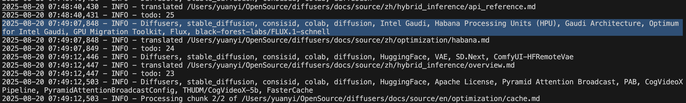
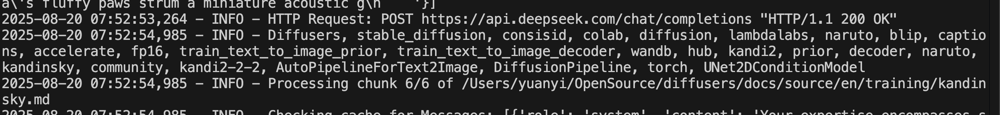
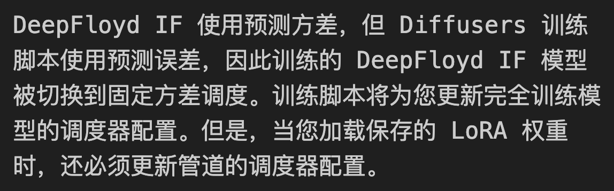

# 自己評価プロンプト

論文 2507.21046v3 に感謝

## コードを見せて

翻訳エージェントを自己評価させるために、自動的に固有名詞を検出してみましょう。
このリポジトリのPRは [リンク](https://github.com/SamYuan1990/i18n-agent-action/pull/53)

コアアイデアは、プロンプトに動的な部分として固有名詞が含まれている場合、LLMに新しい固有名詞を自動検出させ、それらを次のラウンド/チャンクのタスクで統合するように依頼するのはどうでしょうか？

## 設定可能な設計

これはi18nエージェントなので、異なるプロジェクトに簡単に適用できるように、設計段階で `RESERVED WORD` を `Glossary` として保持しました。

プロンプトの `品質保証` で定義されている通り：
```
品質保証ステップ
...
- 曖昧な技術用語や固有名詞に遭遇した場合、簡単な説明を括弧内に提供してください（ユーザーから提供された予約語を参照してください）
```

コンテンツ翻訳を扱う際、LLMと次のように対話します：
```bash
#システムプロンプト
LLM_Client.get_config()["prompts"]["translator"],
#コンテンツ
以下のコンテンツを中国語に翻訳してください、予約語: 予約語 0, 予約語 1...予約語 n in English.
これはドキュメントの1/10部分です。
例のJSON出力形式：
{
        "content": "翻訳されたテキストここに...",
        "metadata": {{"chunk": {i+1}, "total": {len(chunks)}}},
}
翻訳するコンテンツ：
"Hello Transformer"
```

## 設定可能な設計の利点、「Transformer」は映画か... Attention is all you need?

自己評価プロンプトを実装する前に、リポジトリAとリポジトリBを翻訳する必要があるとしましょう。
リポジトリAは映画関連で、リポジトリBはLLMドキュメントリポジトリなので、コンテンツは：
```bash
#コンテンツ
以下のコンテンツを中国語に翻訳してください、予約語: LLM in English.
これはドキュメントの1/10部分です。
例のJSON出力形式：
{
        "content": "翻訳されたテキストここに...",
        "metadata": {{"chunk": {i+1}, "total": {len(chunks)}}},
}
翻訳するコンテンツ：
"Hello Transformer"
```

## Attention is all you need、そうじゃない？

ちょっと待って...「自己注意」を通じてプロセスを改善できる？
ドキュメント翻訳のタスクに戻りましょう。ドキュメントに10チャンクあると仮定します。
**Glossary**ファイルや手動設定を読む代わりに。
それらの**Glossary**用語は、ドキュメントに出現/使用されていますよね？

```
Glossary = LLM内の知識 + 設定（Glossaryファイル内または手動入力） + 固有名詞（ドキュメントに出現）
```

翻訳タスクでは、ドキュメントをLLMに送信しますよね。

---

# LLMに前のチャンクで固有名詞を拾わせ、それらの固有名詞を次のチャンクのGlossaryとして使用するように依頼したらどうでしょうか？

---

## さあ始めよう

### ステップ0 システムプロンプトを更新

システムプロンプトのタスクステップ部分で、LLMに固有名詞を拾うように依頼します。
```
翻訳方法論：
...
- 必要に応じてターゲット言語のドメイン固有の用語を調査し、固有名詞を結果としてリストしてください。
```

### ステップ1 LLMから固有名詞をキャプチャする変数を追加

出力構造を変更して
```bash
例のJSON出力形式：
{
        "content": "翻訳されたテキストここに...",
        "metadata": {{"chunk": 
```
#### テスト
[diffuser](https://github.com/huggingface/diffusers/pull/12179) でテスト済み

手動設定値は `Diffusers, stable_diffusion, consisid, colab` です。

ログから、検出された固有名詞は
`Diffusers, stable_diffusion, consisid, colab, diffusion, ModularPipeline, YiYiXu, modular-diffdiff, modular-diffdiff-0704, DiffDiffBlocks`
であり、これらをステップ2で予約語としてマージできます。

### ステップ2 固有名詞と予約語のマージ

以下は、固有名詞（LLMからの応答）と予約語をマージするサンプル関数の実装です。
```python
def MergePN(str1, str2):
    # 分割し、順序を保って重複を除去
    merged = list(OrderedDict.fromkeys(
        [item.strip() for item in str1.split(",")] + 
        [item.strip() for item in str2.split(",")]
    ))

    result = ", ".join(merged)
    return result
```

## 結果

話を戻すと、最初のチャンク `"Hello Transformer"` から、LLMは固有名詞として `Transformer` を応答し、2番目のチャンクでは、内容は以下のようになります:
```bash
#コンテンツ
Please help translate the following content into Chinese, reserved word: Transformer, LLM in English.
This is part 2 of 10 of the document.
Example json output format:
{
        "content": "translated text here...",
        "metadata": {{"chunk": {i+1}, "total": {len(chunks)}}},
}
Content to translate:
"Transformer from paper attention is all you need, and widely used as LLM...."
```

### ログのスクリーンショット



### 実世界のケース

自動的に DeepFloyd IF を保持し、`DeepFloyd 如果` や `深度弗洛伊德 如果` にしなかったことがわかります。
